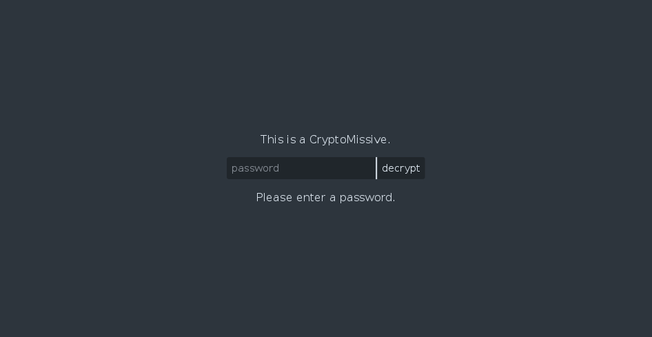

CryptoMissive
=============

This is a simple JS wrapper for HTML that encrypts it contents. It is useful to those who already posses a secret key.


Usage
=====

Producing CryptoMissives is easy, thanks to the automated Python script.

```bash
$ git clone https://github.com/PythonNut/cryptomissive
$ cd cryptomissive
```

Now, make your message. The format of the message is the `<body>` of an HTML document.

```bash
$ emacs secret_message.html # wonderful magic happens here, BTW
$ cat secret_message.html
Yo dude. This message be secret.
```

And finally, produce the _uber secret_ message of doom and destruction!

```bash
$ python secret_message.html encrypted.html "this secret key shall never be guessed"
encrypting secret_message.html ⇒ encrypted.html...
done.
```

And behold! Your new messenger of secrecy has come into being! Navigate to that file in any modern web browser and see for yourself.


